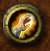
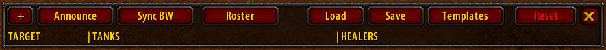
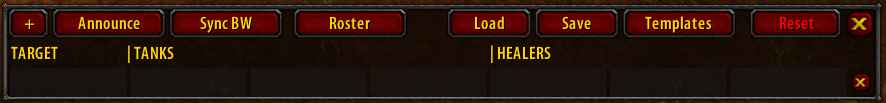

# TWAssignments

Use TWAssignments to assign players to specific targets or tasks for a raid fight.

## Installation

### GitAddonsManager (recommended)
The best way to keep the addon up to date would be [GitAddonsManager](https://woblight.gitlab.io/overview/gitaddonsmanager/).

[Here are some usage instructions](https://turtle-wow.fandom.com/wiki/Addons#How_to_Install_Addons).

Add `https://github.com/arvidinge/TWAssignments.git` to GitAddonsManager and make sure the `master` branch is selected. Using GitAddonsManager you can check for and install updates for all your AddOns with 1 click.

### Manual
1. On the [main page](https://github.com/arvidinge/TWAssignments/tree/master) of the repo, click the code dropdown  and download the repo as a .zip.
1. Unpack the .zip and rename the folder to `TWAssignments` (remove the `-master` part).
1. Move the folder into your Interface/AddOns directory and restart the game.

You will have to do this every time there is a new update, and you won't know there's an update before you visit this page again. I recommend using an addon manager like [GitAddonsManager](#gitaddonsmanager) instead.

## Features

The main feature of TWAssignments is to assign players to specific targets in a fight, and to announce these assignments in the raid chat.

Some important things to know about the addon: 
* Changes can only be made to the assignments while in a raid group. This is for technical reasons and may change in the future. You can also only make changes to the assignments if you are either a leader or an assistant of the raid group.
* It's important that the leader of the raid group has TWAssignments installed. The leader acts as the "server" for automatic synchronization between raid members.
* It's important that every assistant/leader in the raid that is using TWAssignments is using the latest version. Different versions might use different types of messages when synchronizing, so the behaviour of the addon while using different versions is undefined.

### Basic usage
To open the main window, click the button: 

Let's start with an example from a clean slate. 

To add a row of assignments, click the `+` button in the top-left corner. This will add a row of cells to the main window. 

In the first column you select the target to assign players to. 
In columns 2-4, you assign tanks to these targets. 
In columns 5-7, you assign healers to these tanks.

For target, you can pick a lot of things, from raid markers (skull, cross, square etc), boss or adds, left or right side of a room... There are a lot of things to pick from depending on the context of the fight. 
For tanks, you may pick players of any class. 
For healers, you may pick druids, paladins, priests and shamans.

You can pick any player from either your current raid group, or your [roster](#roster).

### Templates

### Roster

### Automatic synchronization

## Integrations

