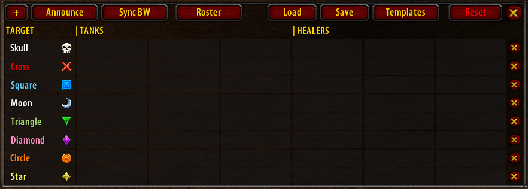

# TWAssignments

Use TWAssignments to assign players to specific targets or tasks for a raid fight.

## Installation

### GitAddonsManager (recommended)
The best way to keep the addon up to date would be [GitAddonsManager](https://woblight.gitlab.io/overview/gitaddonsmanager/).

[Here are some usage instructions](https://turtle-wow.fandom.com/wiki/Addons#How_to_Install_Addons).

Add `https://github.com/arvidinge/TWAssignments.git` to GitAddonsManager and make sure the `master` branch is selected. Using GitAddonsManager you can check for and install updates for all your AddOns with 1 click.

### Manual
1. On the [main page](https://github.com/arvidinge/TWAssignments/tree/master) of the repo, click the code dropdown  and download the repo as a .zip.
1. Unpack the .zip and rename the folder to `TWAssignments` (remove the `-master` part).
1. Move the folder into your Interface/AddOns directory and restart the game.

You will have to do this every time there is a new update, and you won't know there's an update before you visit this page again. I recommend using an addon manager like [GitAddonsManager](#gitaddonsmanager) instead.

## Features

The main feature of TWAssignments is to assign players to specific targets in a fight, and to announce these assignments in the raid chat.

Some important things to know about the addon: 
* Changes can only be made to the assignments while in a raid group. This is for technical reasons and may change in the future. You can also only make changes to the assignments if you are either a leader or an assistant of the raid group.
* It's important that the leader of the raid group has TWAssignments installed. The leader acts as the "server" for automatic synchronization between raid members.
* It's important that every assistant/leader in the raid that is using TWAssignments is using the latest version. Different versions might use different types of messages when synchronizing, so the behaviour of the addon while using different versions is undefined. 
* More information on synchronization in [Automatic Synchronization](#automatic-synchronization).

### Basic usage
Let's go over how you would use the addon without using a [template](#templates).
To open the main window, click the button: 

Let's start from a clean slate:

To add a row of assignments, click the `+` button in the top-left corner. This will add a row of cells to the main window. 

In the first column you select the target to assign players to. 
In columns 2-4, you assign tanks to these targets. 
In columns 5-7, you assign healers to these tanks.

For target, you can pick a lot of things, from raid markers (skull, cross, square etc), boss or adds, left or right side of a room... There are a lot of things to pick from depending on the context of the fight. 
For tanks, you may pick players of any class. 
For healers, you may pick druids, paladins, priests and shamans.

You can pick any player from either your current raid group, or your [roster](#roster). To select a player, click a cell and select them in the dropdown.

Let's say we have a fight with a boss and some adds, and the boss regularly frenzies, requiring a rotation of hunters to tranq it. We might set up our assignments like:

<i>Note: players that are offline or not currently in the raid group are colored red</i>

To announce the assignments to the raid chat, simply click the `Announce` button in the top left of the window:

That covers the basics, however, this set of assignments cannot be saved and loaded again, making it cumbersome to switch assignments between fights. The most common way to use the addon therefore is to make use of the [templates](#templates) feature.

### Templates
Templates are preset assignments for raid encounters in Molten Core, Blackwing Lair, Ahn'Qiraj (40) and Naxxramas. To learn how to use them, let's use the `Gaar` template for Molten Core as an example. 

To load the template, use the `Templates` button in the top right of the frame to open the templates dropdown. The template is simply a set of rows, one for Gaar himself, and one for each one of his adds, to which you can either assign tanks to tank them, or warlocks to banish them:

Let's assign some players:

If you play with these players regularly, you might want to save the Gaar template with these players assigned. To do so, just click the `Save` button next to the templates dropdown. Whenever you click the `Load` button with the Gaar template selected, the saved assignments will overwrite whatever the current assignments are.  
<b>Please note</b> that only the player names are saved - adding or removing rows, and changing the values in the target column is not persisted to disk and will be gone from the template when you relog or reload UI. The next time you relog, select the Gaar template and click `Load`, the number of rows and the values of cells in the target column will be as in the default Gaar template. If you saved a name to a row that doesn't exist in the template, an error will occur. 

### Roster
Your roster is a list of players you regularly play with, that you would like to be able to assign to targets without them being in a raid group with you. The use case for the feature is for leaders of guild raids to be able to set up assignments before the raid group forms.

To manage your roster, click the `Roster` button at the top of the main window. This opens the roster window.

To add a player to your roster, click `Add Player(s)` on their respective class section of the roster. This opens the Add to Class window:

Type their name in the text box and click Done. You can type multiple names, just separate them one on each line:

The player should now appear under their class section in the roster window. They are now available to be assigned in the main window. You can use the `x` next to their name to remove them from the roster:

In the main window, the new roster players are now assignable:

### Automatic synchronization
The assignments table, the selected template and rosters of the leader and all assistants in the raid are always synchronized between raid members with TWAssignments installed. The leader of the raid acts as the master node for synchronization, which means that when players join the raid, they request a full sync of data, and the leader of the raid broadcasts the current template and assignments table data. This is why it's crucial that the leader of the raid has TWAssignments installed, and it's important that everyone uses the latest version since there might be breaking changes in the way the addon communicates with other clients between versions. 

While in a raid, the rosters of the leader and all assistants are temporarily shared between all players using the addon. Any assistant can change the current assignments and select players from other people's rosters. Duplicate names are removed within each class, but allowed across classes. When you leave the raid, all roster entries from other players are removed.

## Integrations

### QuickHeal
Todo: QuickHeal integration documentation

### BigWigs
Todo: BigWigs integration for 4 horsemen documentation
